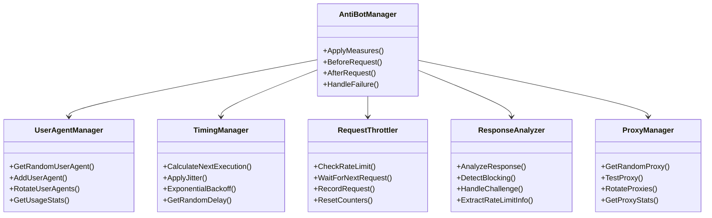
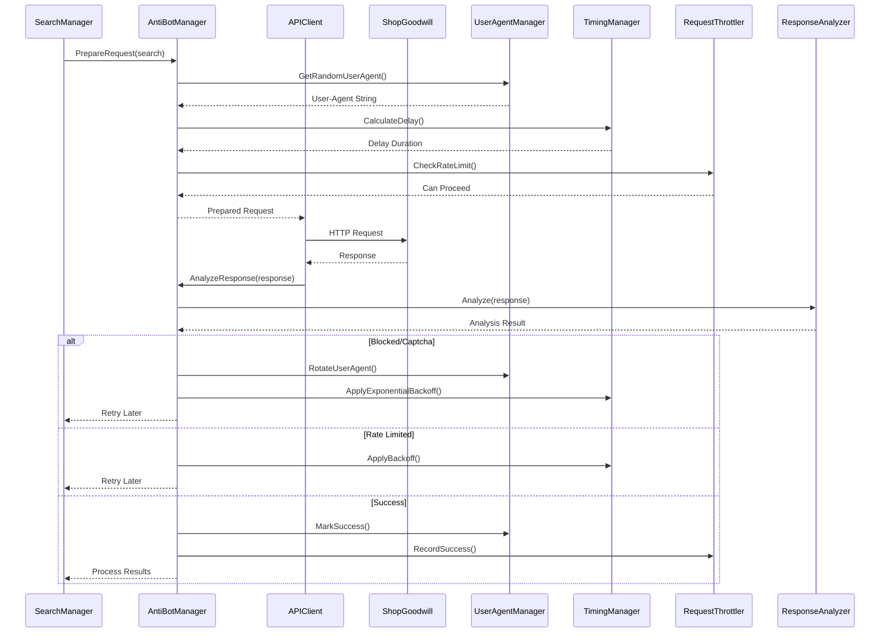

# go-find-goodwill Anti-Bot Detection Measures

## Overview
This document specifies the anti-bot detection and mitigation strategies for the go-find-goodwill application to prevent detection and blocking by ShopGoodwill's anti-scraping systems.

## Anti-Bot Architecture



## Core Anti-Bot Measures

### 1. User Agent Rotation System

#### User Agent Database
```sql
CREATE TABLE user_agents (
    id INTEGER PRIMARY KEY AUTOINCREMENT,
    user_agent TEXT NOT NULL UNIQUE,
    browser_type TEXT,
    browser_version TEXT,
    os_type TEXT,
    os_version TEXT,
    device_type TEXT,
    last_used TIMESTAMP,
    usage_count INTEGER DEFAULT 0,
    success_rate REAL DEFAULT 1.0,
    is_active BOOLEAN DEFAULT 1,
    created_at TIMESTAMP DEFAULT CURRENT_TIMESTAMP
);

CREATE INDEX idx_user_agents_last_used ON user_agents(last_used);
CREATE INDEX idx_user_agents_success_rate ON user_agents(success_rate);
```

#### User Agent Rotation Algorithm
```go
type UserAgentManager struct {
    db          *sql.DB
    config      UserAgentConfig
    currentUA   string
    lastRotated time.Time
    log         *logrus.Logger
}

func (m *UserAgentManager) GetRandomUserAgent() (string, error) {
    // Strategy: Weighted random selection based on success rate and usage
    query := `
        SELECT user_agent
        FROM user_agents
        WHERE is_active = 1
        ORDER BY
            success_rate DESC,
            usage_count ASC,
            RANDOM()
        LIMIT 1
    `

    var userAgent string
    err := m.db.QueryRow(query).Scan(&userAgent)
    if err != nil {
        return "", fmt.Errorf("failed to get user agent: %w", err)
    }

    // Update usage stats
    _, err = m.db.Exec(`
        UPDATE user_agents
        SET usage_count = usage_count + 1, last_used = CURRENT_TIMESTAMP
        WHERE user_agent = ?
    `, userAgent)

    if err != nil {
        m.log.Warnf("Failed to update user agent stats: %v", err)
    }

    return userAgent, nil
}

func (m *UserAgentManager) RotateIfNeeded() bool {
    // Rotate based on time or request count
    if time.Since(m.lastRotated) > m.config.RotationInterval {
        return true
    }

    // Also rotate if we've made too many requests with current UA
    if m.config.RequestsPerUA > 0 {
        var count int
        m.db.QueryRow(`
            SELECT usage_count
            FROM user_agents
            WHERE user_agent = ?
        `, m.currentUA).Scan(&count)

        if count >= m.config.RequestsPerUA {
            return true
        }
    }

    return false
}
```

### 2. Request Timing and Randomization

#### Timing Configuration
```go
type TimingConfig struct {
    BaseInterval        time.Duration
    MinJitter           time.Duration
    MaxJitter           time.Duration
    MaxBackoff          time.Duration
    InitialBackoff      time.Duration
    HumanLikeVariation  bool
    TimeOfDayPreference string // "morning", "evening", "random"
}
```

#### Timing Algorithm
```go
func (m *TimingManager) CalculateNextExecution() time.Time {
    now := time.Now()

    // Apply base interval
    next := now.Add(m.config.BaseInterval)

    // Apply jitter (random variation)
    if m.config.MinJitter > 0 && m.config.MaxJitter > 0 {
        jitter := m.getRandomJitter()
        next = next.Add(jitter)
    }

    // Apply time of day preference
    if m.config.TimeOfDayPreference != "random" {
        next = m.applyTimeOfDayPreference(next)
    }

    // Apply human-like variation
    if m.config.HumanLikeVariation {
        next = m.applyHumanLikeVariation(next)
    }

    return next
}

func (m *TimingManager) getRandomJitter() time.Duration {
    min := int64(m.config.MinJitter)
    max := int64(m.config.MaxJitter)
    random := rand.Int63n(max-min) + min
    return time.Duration(random)
}

func (m *TimingManager) applyHumanLikeVariation(t time.Time) time.Time {
    // Add small random variations that mimic human behavior
    // Avoid exact intervals, add pauses that look like someone taking breaks

    // 10% chance to add a "coffee break" (5-15 minutes)
    if rand.Float64() < 0.1 {
        coffeeBreak := time.Duration(rand.Intn(10)+5) * time.Minute
        return t.Add(coffeeBreak)
    }

    // 5% chance to add a "lunch break" (30-60 minutes)
    if rand.Float64() < 0.05 {
        lunchBreak := time.Duration(rand.Intn(30)+30) * time.Minute
        return t.Add(lunchBreak)
    }

    return t
}
```

### 3. Exponential Backoff System

#### Backoff Algorithm
```go
func (m *TimingManager) ApplyExponentialBackoff(retryCount int) time.Duration {
    if retryCount == 0 {
        return 0
    }

    // Calculate backoff: min(initial * 2^retryCount, maxBackoff)
    backoff := m.config.InitialBackoff
    for i := 1; i < retryCount; i++ {
        backoff *= 2
        if backoff > m.config.MaxBackoff {
            backoff = m.config.MaxBackoff
            break
        }
    }

    // Add some randomness to avoid synchronization
    randomFactor := 0.8 + rand.Float64()*0.4 // 0.8-1.2
    randomizedBackoff := time.Duration(float64(backoff) * randomFactor)

    return randomizedBackoff
}
```

### 4. Request Throttling System

#### Throttling Configuration
```go
type ThrottleConfig struct {
    RequestsPerMinute int
    BurstLimit        int
    WindowSize        time.Duration
    IPRotation        bool
    ProxyRotation     bool
}
```

#### Throttling Implementation
```go
type RequestThrottler struct {
    config      ThrottleConfig
    requestLog  []time.Time
    lastReset  time.Time
    mu         sync.Mutex
    log        *logrus.Logger
}

func (t *RequestThrottler) CheckRateLimit() bool {
    t.mu.Lock()
    defer t.mu.Unlock()

    now := time.Now()

    // Reset if window has passed
    if now.Sub(t.lastReset) > t.config.WindowSize {
        t.requestLog = []time.Time{now}
        t.lastReset = now
        return true
    }

    // Remove old requests
    cutoff := now.Add(-t.config.WindowSize)
    var recentRequests []time.Time
    for _, reqTime := range t.requestLog {
        if reqTime.After(cutoff) {
            recentRequests = append(recentRequests, reqTime)
        }
    }
    t.requestLog = recentRequests

    // Check if we can make another request
    if len(t.requestLog) >= t.config.RequestsPerMinute {
        return false
    }

    // Add current request
    t.requestLog = append(t.requestLog, now)
    return true
}

func (t *RequestThrottler) WaitForNextRequest() {
    t.mu.Lock()
    defer t.mu.Unlock()

    for {
        if t.CheckRateLimit() {
            return
        }
        time.Sleep(1 * time.Second)
    }
}
```

### 5. Response Analysis and Adaptation

#### Response Analyzer
```go
type ResponseAnalyzer struct {
    patterns     []BlockPattern
    challengeURLs []string
    rateLimitPatterns []string
    log        *logrus.Logger
}

type BlockPattern struct {
    Regex       *regexp.Regexp
    Type        string // "captcha", "block", "rate_limit"
    Severity    int    // 1-10
}

func (a *ResponseAnalyzer) AnalyzeResponse(resp *http.Response, body []byte) (AnalysisResult, error) {
    result := AnalysisResult{
        IsBlocked: false,
        IsCaptcha: false,
        IsRateLimited: false,
        NeedsRotation: false,
        ActionRequired: "none",
    }

    // Check status codes
    switch resp.StatusCode {
    case 403:
        result.IsBlocked = true
        result.ActionRequired = "rotate_ua"
    case 429:
        result.IsRateLimited = true
        result.ActionRequired = "backoff"
    case 503:
        result.IsBlocked = true
        result.ActionRequired = "rotate_ua_and_proxy"
    }

    // Check body content
    bodyStr := string(body)

    // Check for CAPTCHA patterns
    for _, pattern := range a.patterns {
        if pattern.Type == "captcha" && pattern.Regex.MatchString(bodyStr) {
            result.IsCaptcha = true
            result.IsBlocked = true
            result.ActionRequired = "rotate_ua_and_proxy"
            result.Severity = pattern.Severity
            break
        }
    }

    // Check for rate limit headers
    if resp.Header.Get("X-RateLimit-Remaining") == "0" {
        result.IsRateLimited = true
        result.ActionRequired = "backoff"
    }

    // Check for challenge URLs
    for _, url := range a.challengeURLs {
        if strings.Contains(bodyStr, url) {
            result.IsCaptcha = true
            result.IsBlocked = true
            result.ActionRequired = "rotate_ua_and_proxy"
            break
        }
    }

    return result, nil
}
```

## Integration with ShopGoodwill API Client

### Enhanced API Client with Anti-Bot Measures


## Configuration and Monitoring

### Anti-Bot Configuration
```yaml
anti_bot:
  user_agent:
    rotation_enabled: true
    rotation_interval: "1h"
    requests_per_ua: 20
    min_success_rate: 0.8
    default_user_agents:
      - "Mozilla/5.0 (Windows NT 10.0; Win64; x64) AppleWebKit/537.36 (KHTML, like Gecko) Chrome/91.0.4472.124 Safari/537.36"
      - "Mozilla/5.0 (Macintosh; Intel Mac OS X 10_15_7) AppleWebKit/537.36 (KHTML, like Gecko) Chrome/91.0.4472.124 Safari/537.36"
      - "Mozilla/5.0 (Windows NT 10.0; Win64; x64; rv:89.0) Gecko/20100101 Firefox/89.0"

  timing:
    base_interval: "15m"
    min_jitter: "2m"
    max_jitter: "5m"
    human_like_variation: true
    time_of_day_preference: "random"

  throttling:
    requests_per_minute: 15
    burst_limit: 5
    window_size: "1m"

  response_analysis:
    block_patterns:
      - regex: "captcha|verification|security check"
        type: "captcha"
        severity: 9
      - regex: "access denied|forbidden|blocked"
        type: "block"
        severity: 8
    challenge_urls:
      - "/captcha/"
      - "/verification/"
      - "/security-check"

  monitoring:
    log_blocked_requests: true
    alert_threshold: 3
    alert_cooldown: "1h"
```

### Monitoring and Alerts
```go
type AntiBotMonitor struct {
    blockedRequestCount int
    lastAlertTime      time.Time
    config            AntiBotConfig
    log               *logrus.Logger
    alertChan         chan<- Alert
}

func (m *AntiBotMonitor) RecordBlockedRequest() {
    m.blockedRequestCount++

    if m.blockedRequestCount >= m.config.AlertThreshold {
        if time.Since(m.lastAlertTime) > m.config.AlertCooldown {
            m.alertChan <- Alert{
                Type:    "anti_bot_alert",
                Message: fmt.Sprintf("High rate of blocked requests detected (%d)", m.blockedRequestCount),
                Severity: "high",
                Data: map[string]interface{}{
                    "blocked_count": m.blockedRequestCount,
                    "threshold":    m.config.AlertThreshold,
                },
            }
            m.lastAlertTime = time.Now()
            m.blockedRequestCount = 0
        }
    }
}
```

## Implementation Roadmap

### Phase 1: Core Anti-Bot Measures
- [ ] Implement user agent rotation system
- [ ] Create timing randomization
- [ ] Add basic request throttling
- [ ] Build response analyzer

### Phase 2: Advanced Features
- [ ] Implement exponential backoff
- [ ] Add human-like timing patterns
- [ ] Create proxy rotation system
- [ ] Add monitoring and alerts

### Phase 3: Integration and Testing
- [ ] Integrate with API client
- [ ] Add comprehensive logging
- [ ] Implement failure recovery
- [ ] Create test scenarios

## Best Practices and Recommendations

### User Agent Management
- **Diversity**: Use a wide range of realistic user agents
- **Rotation**: Rotate frequently but not predictably
- **Success Tracking**: Prefer user agents with good success rates
- **Updates**: Regularly update user agent list

### Timing Strategies
- **Randomization**: Always add random jitter to intervals
- **Human Patterns**: Mimic human usage patterns
- **Time of Day**: Vary activity based on time of day
- **Adaptive**: Adjust based on response patterns

### Error Handling
- **Graceful Degradation**: Continue operation after failures
- **Exponential Backoff**: Increase delays on repeated failures
- **Circuit Breakers**: Temporarily disable operations after too many failures
- **Alerting**: Notify administrators of persistent issues

### Monitoring
- **Request Logging**: Track all requests and responses
- **Success Rates**: Monitor success rates by user agent
- **Block Detection**: Quickly identify when blocking occurs
- **Trend Analysis**: Look for patterns in blocking

This comprehensive anti-bot detection system provides robust protection against detection and blocking by ShopGoodwill's anti-scraping systems while maintaining reliable search functionality.