# go-find-goodwill Architecture Diagram

## System Overview

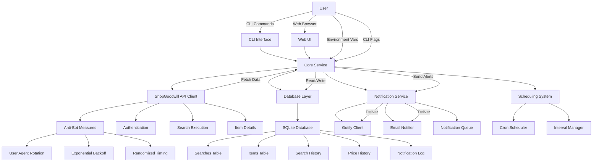

## Component Interaction Flow

### Search Execution Flow
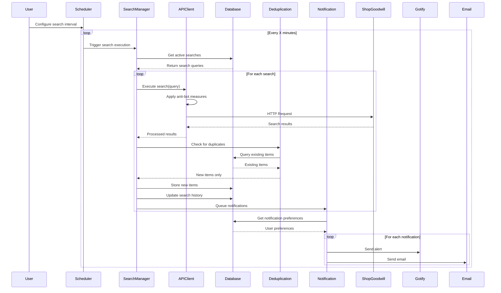

## Detailed Component Architecture

### 1. CLI Interface Architecture
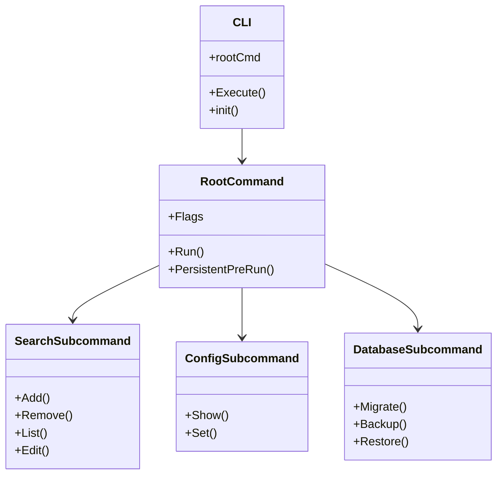

### 2. Core Service Architecture
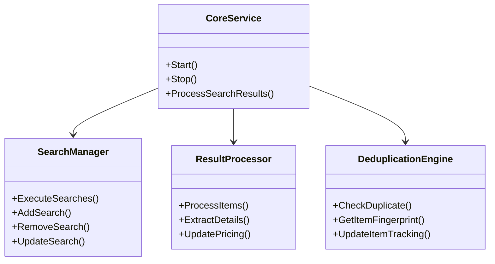

### 3. Database Layer Architecture
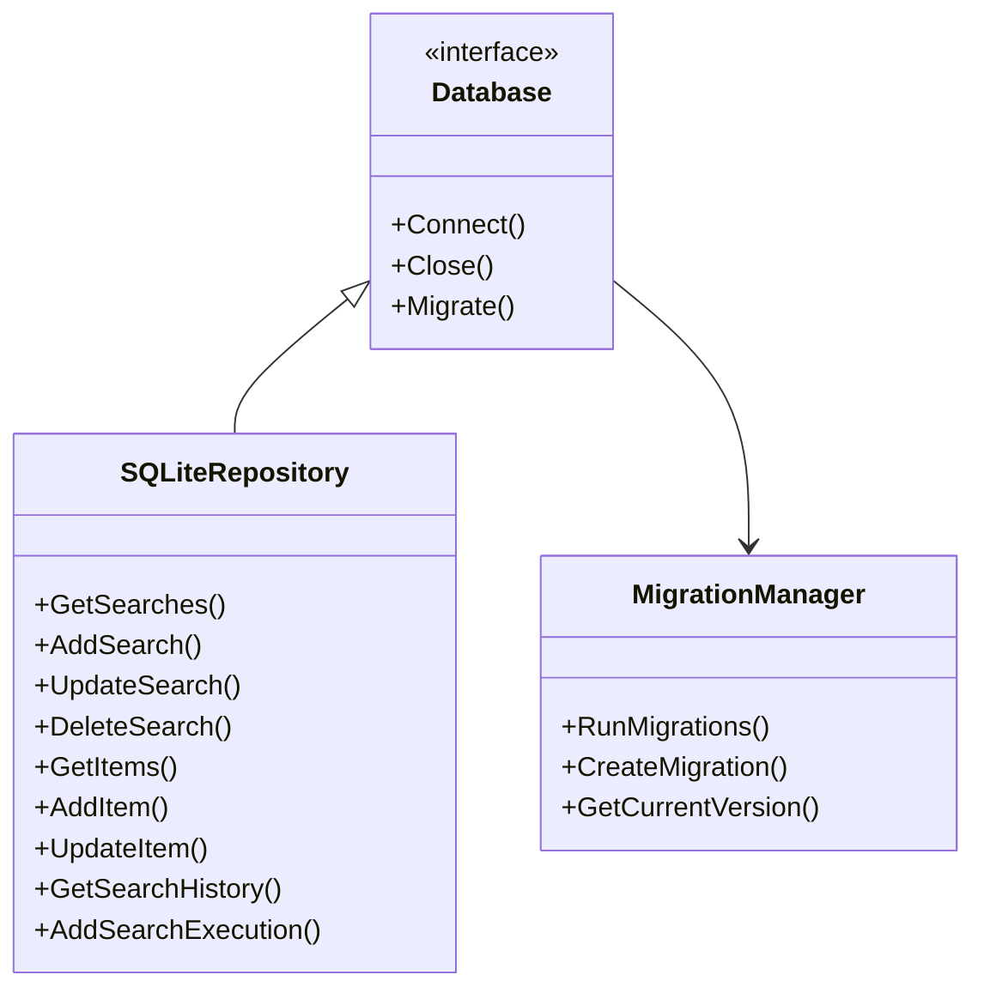

### 4. Notification System Architecture
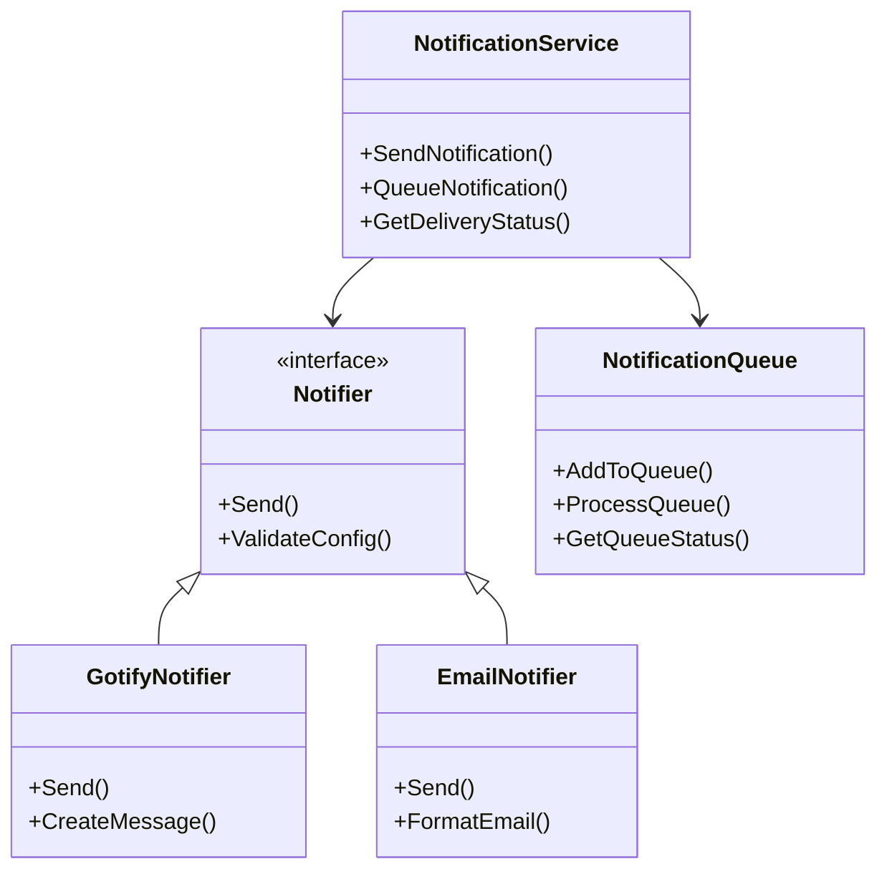

### 5. Anti-Bot Measures Architecture
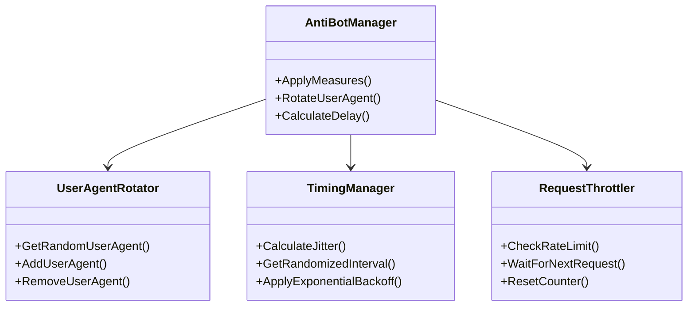

## Data Flow Architecture

### Search Result Processing Flow
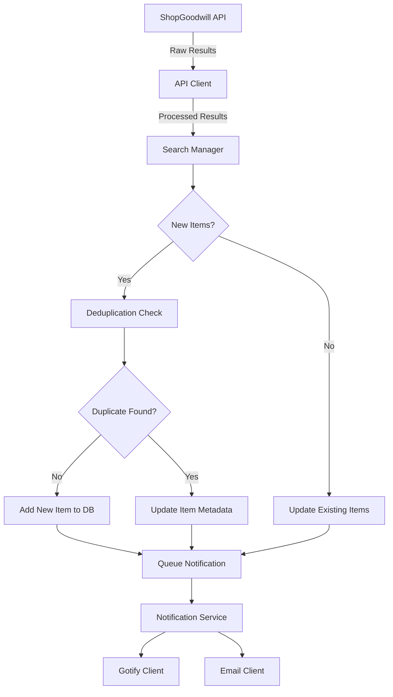

### Database Interaction Flow
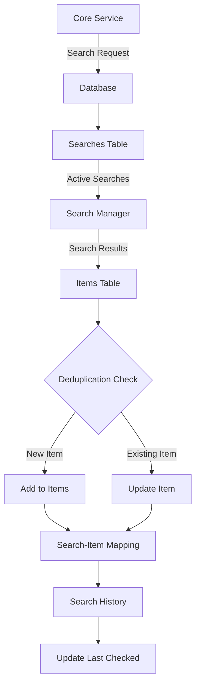

## Deployment Architecture

### Containerized Deployment
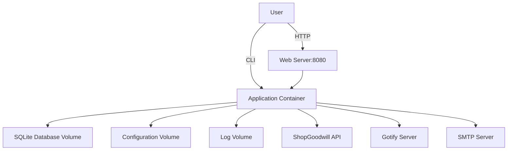

### Configuration Management
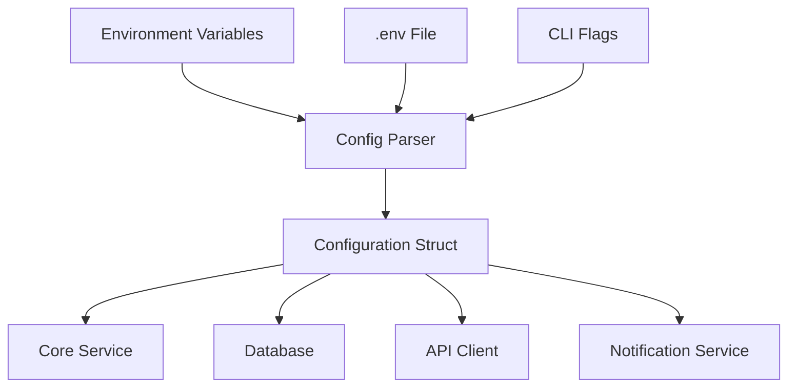

## Error Handling Architecture

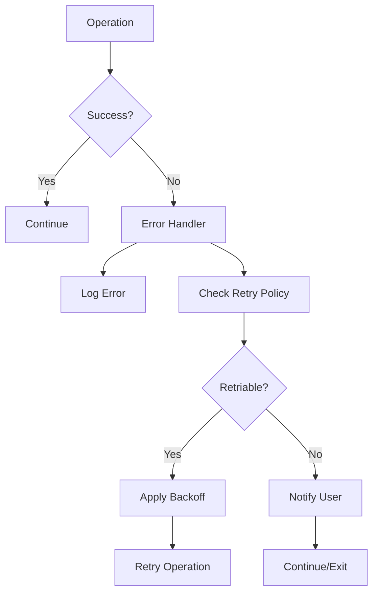

This comprehensive architecture diagram provides a visual representation of all major components, their interactions, and the data flow throughout the go-find-goodwill application.