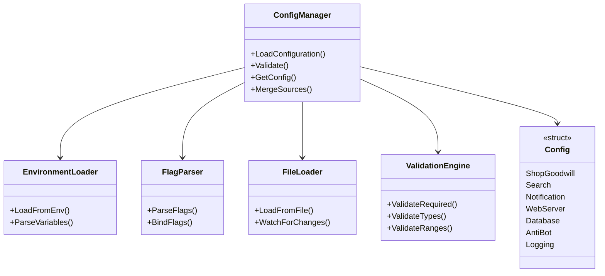
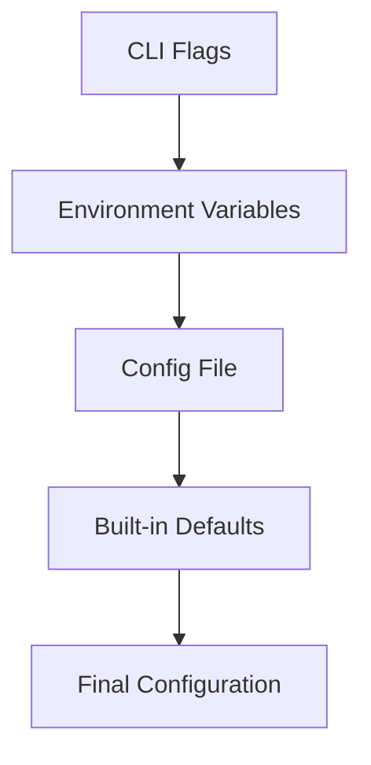

# go-find-goodwill Configuration System

## Overview
This document specifies the complete configuration system for the go-find-goodwill application, including environment variables, CLI flags, configuration files, and their integration.

## Configuration Architecture



## Configuration Sources and Priority

### Priority Order (Highest to Lowest)
1. **CLI Flags** - Override all other sources
2. **Environment Variables** - Override config files
3. **Config File** - Default values
4. **Built-in Defaults** - Fallback values



## Environment Variables

### Complete Environment Variable Reference

#### ShopGoodwill Configuration
```
GOODWILL_USERNAME          # ShopGoodwill username
GOODWILL_PASSWORD          # ShopGoodwill password
GOODWILL_API_BASE_URL      # API base URL (default: https://api.shopgoodwill.com)
GOODWILL_MAX_RETRIES       # Max API retries (default: 3)
GOODWILL_REQUEST_TIMEOUT   # Request timeout in seconds (default: 30)
```

#### Search Configuration
```
SEARCH_INTERVAL_MINUTES    # Search execution interval (default: 15)
SEARCH_MIN_INTERVAL       # Minimum allowed interval (default: 5)
SEARCH_MAX_INTERVAL       # Maximum allowed interval (default: 1440)
NOTIFICATION_THRESHOLD_DAYS # Days before auction end to notify (default: 1)
ENABLE_REGEX_SEARCHES     # Enable regex-based similar searches (default: true)
SEARCH_CONCURRENCY        # Max concurrent searches (default: 3)
```

#### Notification Configuration
```
NOTIFICATION_GOTIFY_ENABLED   # Enable Gotify notifications (default: false)
NOTIFICATION_GOTIFY_URL      # Gotify server URL
NOTIFICATION_GOTIFY_TOKEN    # Gotify authentication token
NOTIFICATION_GOTIFY_PRIORITY # Gotify message priority (default: 5)

NOTIFICATION_EMAIL_ENABLED    # Enable email notifications (default: false)
NOTIFICATION_EMAIL_SMTP_SERVER # SMTP server
NOTIFICATION_EMAIL_SMTP_PORT   # SMTP port (default: 587)
NOTIFICATION_EMAIL_USERNAME   # SMTP username
NOTIFICATION_EMAIL_PASSWORD   # SMTP password
NOTIFICATION_EMAIL_FROM       # From email address
NOTIFICATION_EMAIL_TO         # To email address (comma-separated)

NOTIFICATION_WEBHOOK_ENABLED # Enable webhook notifications (default: false)
NOTIFICATION_WEBHOOK_URLS    # Webhook URLs (comma-separated)
```

#### Web Server Configuration
```
WEB_SERVER_ENABLED   # Enable web server (default: true)
WEB_SERVER_HOST      # Host to bind to (default: 0.0.0.0)
WEB_SERVER_PORT      # Port to listen on (default: 8080)
WEB_SERVER_TLS_ENABLED # Enable TLS (default: false)
WEB_SERVER_TLS_CERT  # TLS certificate file
WEB_SERVER_TLS_KEY   # TLS key file
WEB_SERVER_STATIC_DIR # Static files directory (default: web/static)
WEB_SERVER_TEMPLATE_DIR # Template files directory (default: web/templates)
```

#### Database Configuration
```
DB_PATH                # SQLite database path (default: ./goodwill.db)
DB_MAX_CONNECTIONS     # Max database connections (default: 10)
DB_CONNECTION_TIMEOUT # Connection timeout in seconds (default: 30)
DB_MIGRATION_PATH      # Migration files path (default: internal/goodwill/db/migrations)
```

#### Anti-Bot Configuration
```
ANTIBOT_USER_AGENT_ROTATION # Enable user agent rotation (default: true)
ANTIBOT_ROTATION_INTERVAL   # Rotation interval (default: 1h)
ANTIBOT_REQUESTS_PER_UA    # Requests per user agent before rotation (default: 20)
ANTIBOT_BASE_INTERVAL      # Base search interval (default: 15m)
ANTIBOT_MIN_JITTER          # Minimum jitter (default: 2m)
ANTIBOT_MAX_JITTER          # Maximum jitter (default: 5m)
ANTIBOT_HUMAN_VARIATION     # Enable human-like timing (default: true)
ANTIBOT_REQUESTS_PER_MINUTE # Max requests per minute (default: 15)
ANTIBOT_BURST_LIMIT         # Burst limit (default: 5)
```

#### Logging Configuration
```
LOG_LEVEL          # Log level (debug, info, warn, error) (default: info)
LOG_FORMAT         # Log format (text, json) (default: text)
LOG_FILE           # Log file path (empty for stdout)
LOG_MAX_SIZE       # Max log file size in MB (default: 10)
LOG_MAX_BACKUPS    # Max log backups (default: 3)
LOG_MAX_AGE        # Max log age in days (default: 7)
```

## CLI Flags

### Root Command Flags
```bash
go-find-goodwill [global options] command [command options] [arguments...]
```

### Global Options
```
  --debug, -d              Enable debug logging
  --config, -c string      Config file path (default: ./config.yaml)
  --log-level string       Log level (debug, info, warn, error) (default: "info")
  --log-format string      Log format (text, json) (default: "text")
```

### Search Commands
```
  search list              List all searches
  search add               Add a new search
  search remove             Remove a search
  search edit               Edit a search
  search execute            Execute a search manually
  search enable             Enable a search
  search disable            Disable a search
```

### Configuration Commands
```
  config show              Show current configuration
  config set               Set configuration values
  config validate           Validate configuration
  config export             Export configuration
  config import             Import configuration
```

### Database Commands
```
  db migrate               Run database migrations
  db backup                Backup database
  db restore               Restore database
  db status                Show database status
  db optimize              Optimize database
```

### Web Server Commands
```
  web start                Start web server
  web stop                 Stop web server
  web restart              Restart web server
  web status               Show web server status
```

### Complete Flag Reference
```go
// Root command flags
rootCmd.PersistentFlags().BoolVarP(&debug, "debug", "d", false, "Enable debug-level logging")
rootCmd.PersistentFlags().StringVarP(&configFile, "config", "c", "./config.yaml", "Config file path")
rootCmd.PersistentFlags().StringVar(&logLevel, "log-level", "info", "Log level (debug, info, warn, error)")
rootCmd.PersistentFlags().StringVar(&logFormat, "log-format", "text", "Log format (text, json)")

// Search flags
searchCmd.Flags().StringVarP(&searchQuery, "query", "q", "", "Search query")
searchCmd.Flags().StringVarP(&searchName, "name", "n", "", "Search name")
searchCmd.Flags().BoolVarP(&searchEnabled, "enabled", "e", true, "Enable search")
searchCmd.Flags().IntVar(&notificationThreshold, "notify-days", 1, "Notification threshold in days")
searchCmd.Flags().Float64Var(&minPrice, "min-price", 0, "Minimum price")
searchCmd.Flags().Float64Var(&maxPrice, "max-price", 0, "Maximum price")
searchCmd.Flags().StringVar(&category, "category", "", "Category filter")
searchCmd.Flags().StringVar(&regexPattern, "regex", "", "Regex pattern for similar searches")

// Web server flags
webCmd.Flags().StringVar(&webHost, "host", "0.0.0.0", "Host to bind to")
webCmd.Flags().IntVar(&webPort, "port", 8080, "Port to listen on")
webCmd.Flags().BoolVar(&webTLS, "tls", false, "Enable TLS")
webCmd.Flags().StringVar(&webCert, "cert", "", "TLS certificate file")
webCmd.Flags().StringVar(&webKey, "key", "", "TLS key file")

// Database flags
dbCmd.Flags().StringVar(&dbPath, "path", "./goodwill.db", "Database file path")
dbCmd.Flags().BoolVar(&dbForce, "force", false, "Force operation (e.g., for restore)")
```

## Configuration File Structure

### YAML Configuration Format
```yaml
# ShopGoodwill configuration
shopgoodwill:
  username: "your_username"
  password: "your_password"
  api_base_url: "https://api.shopgoodwill.com"
  max_retries: 3
  request_timeout: 30s

# Search configuration
search:
  interval_minutes: 15
  min_interval: 5
  max_interval: 1440
  notification_threshold_days: 1
  enable_regex_searches: true
  concurrency: 3

# Notification configuration
notification:
  gotify:
    enabled: false
    url: ""
    token: ""
    priority: 5
  email:
    enabled: false
    smtp_server: ""
    smtp_port: 587
    username: ""
    password: ""
    from: ""
    to: ""
  webhook:
    enabled: false
    urls: []
    timeout: 10s

# Web server configuration
web:
  enabled: true
  host: "0.0.0.0"
  port: 8080
  tls:
    enabled: false
    cert_file: ""
    key_file: ""
  static_dir: "web/static"
  template_dir: "web/templates"
  cors:
    allowed_origins: ["*"]
    allowed_methods: ["GET", "POST", "PUT", "DELETE", "OPTIONS"]
    allowed_headers: ["Content-Type", "Authorization"]

# Database configuration
database:
  path: "./goodwill.db"
  max_connections: 10
  connection_timeout: 30s
  migration_path: "internal/goodwill/db/migrations"

# Anti-bot configuration
antibot:
  user_agent:
    rotation_enabled: true
    rotation_interval: "1h"
    requests_per_ua: 20
    min_success_rate: 0.8
  timing:
    base_interval: "15m"
    min_jitter: "2m"
    max_jitter: "5m"
    human_like_variation: true
  throttling:
    requests_per_minute: 15
    burst_limit: 5

# Logging configuration
logging:
  level: "info"
  format: "text"
  file: ""
  max_size: 10
  max_backups: 3
  max_age: 7
```

## Configuration Management System

### Config Manager Implementation
```go
type ConfigManager struct {
    envLoader      *EnvironmentLoader
    flagParser     *FlagParser
    fileLoader     *FileLoader
    validator      *ValidationEngine
    config        *Config
    configFile    string
    log           *logrus.Logger
    mu            sync.RWMutex
}

func NewConfigManager() *ConfigManager {
    return &ConfigManager{
        envLoader:   NewEnvironmentLoader(),
        flagParser:  NewFlagParser(),
        fileLoader:  NewFileLoader(),
        validator:   NewValidationEngine(),
        config:      &Config{},
        log:        logrus.New(),
    }
}

func (m *ConfigManager) LoadConfiguration() error {
    m.mu.Lock()
    defer m.mu.Unlock()

    // Load in priority order (lowest to highest)
    err := m.loadDefaults()
    if err != nil {
        return fmt.Errorf("failed to load defaults: %w", err)
    }

    err = m.loadFromFile()
    if err != nil {
        m.log.Warnf("Failed to load from config file: %v", err)
    }

    err = m.loadFromEnvironment()
    if err != nil {
        m.log.Warnf("Failed to load from environment: %v", err)
    }

    err = m.loadFromFlags()
    if err != nil {
        m.log.Warnf("Failed to load from flags: %v", err)
    }

    err = m.validate()
    if err != nil {
        return fmt.Errorf("configuration validation failed: %w", err)
    }

    return nil
}

func (m *ConfigManager) validate() error {
    // Validate required fields
    requiredFields := []string{
        "shopgoodwill.username",
        "shopgoodwill.password",
    }

    for _, field := range requiredFields {
        if !m.isFieldSet(field) {
            return fmt.Errorf("required field %s is not set", field)
        }
    }

    // Validate ranges
    if m.config.Search.IntervalMinutes < m.config.Search.MinInterval {
        return fmt.Errorf("search interval cannot be less than min interval")
    }

    if m.config.Search.IntervalMinutes > m.config.Search.MaxInterval {
        return fmt.Errorf("search interval cannot be greater than max interval")
    }

    // Validate URLs
    if m.config.Notification.Gotify.Enabled && m.config.Notification.Gotify.URL == "" {
        return fmt.Errorf("gotify URL is required when gotify is enabled")
    }

    return nil
}
```

## Configuration Validation

### Validation Rules
```go
type ValidationRule struct {
    Field       string
    Required    bool
    Type        string
    Min         *float64
    Max         *float64
    Pattern     *regexp.Regexp
    DependsOn   string
    DependsValue interface{}
}

func (v *ValidationEngine) AddRules() {
    v.rules = []ValidationRule{
        {
            Field: "shopgoodwill.username",
            Required: true,
            Type: "string",
        },
        {
            Field: "shopgoodwill.password",
            Required: true,
            Type: "string",
        },
        {
            Field: "search.interval_minutes",
            Required: false,
            Type: "int",
            Min: pointer.To(float64(1)),
            Max: pointer.To(float64(1440)),
        },
        {
            Field: "notification.gotify.url",
            Required: false,
            Type: "string",
            DependsOn: "notification.gotify.enabled",
            DependsValue: true,
        },
        {
            Field: "web.tls.cert_file",
            Required: false,
            Type: "string",
            DependsOn: "web.tls.enabled",
            DependsValue: true,
        },
        {
            Field: "web.tls.key_file",
            Required: false,
            Type: "string",
            DependsOn: "web.tls.enabled",
            DependsValue: true,
        },
    }
}
```

## Configuration Override System

### Environment Variable Override Example
```bash
# Override specific configuration values via environment
export GOODWILL_USERNAME="myusername"
export GOODWILL_PASSWORD="mypassword"
export SEARCH_INTERVAL_MINUTES=30
export NOTIFICATION_GOTIFY_ENABLED=true
export NOTIFICATION_GOTIFY_URL="https://gotify.example.com"
export NOTIFICATION_GOTIFY_TOKEN="mytoken"
```

### CLI Flag Override Example
```bash
# Override configuration via CLI flags
./go-find-goodwill \
  --debug \
  --log-level debug \
  --shopgoodwill-username myusername \
  --shopgoodwill-password mypassword \
  --search-interval 30 \
  --notification-gotify-enabled \
  --notification-gotify-url https://gotify.example.com \
  --notification-gotify-token mytoken
```

## Configuration File Management

### File Watching and Hot Reload
```go
func (m *ConfigManager) WatchForChanges(ctx context.Context) {
    if m.configFile == "" {
        return
    }

    watcher, err := fsnotify.NewWatcher()
    if err != nil {
        m.log.Errorf("Failed to create file watcher: %v", err)
        return
    }
    defer watcher.Close()

    err = watcher.Add(m.configFile)
    if err != nil {
        m.log.Errorf("Failed to watch config file: %v", err)
        return
    }

    for {
        select {
        case event, ok := <-watcher.Events:
            if !ok {
                return
            }

            if event.Op&fsnotify.Write == fsnotify.Write {
                m.log.Info("Config file changed, reloading...")
                err := m.LoadConfiguration()
                if err != nil {
                    m.log.Errorf("Failed to reload configuration: %v", err)
                } else {
                    m.log.Info("Configuration reloaded successfully")
                    // Notify other components of config change
                    m.notifyConfigChange()
                }
            }

        case err, ok := <-watcher.Errors:
            if !ok {
                return
            }
            m.log.Errorf("Config watcher error: %v", err)
        }
    }
}
```

## Security Considerations

### Sensitive Data Handling
- **Passwords**: Never log or display in debug output
- **Tokens**: Treat as sensitive credentials
- **File Permissions**: Restrict config file permissions (600)
- **Environment**: Use secure environment variable storage

### Configuration Encryption
```go
type EncryptedConfig struct {
    EncryptedFields map[string]string
    EncryptionKey   string
}

func (e *EncryptedConfig) EncryptField(fieldName, value string) (string, error) {
    // Implement encryption using AES or similar
    // Store encrypted value in config
}

func (e *EncryptedConfig) DecryptField(fieldName string) (string, error) {
    // Decrypt field using stored encryption key
}
```

## Configuration Documentation

### Example Configuration Files
```yaml
# config.production.yaml
shopgoodwill:
  username: "${GOODWILL_USERNAME}"
  password: "${GOODWILL_PASSWORD}"

search:
  interval_minutes: 15
  notification_threshold_days: 1

notification:
  gotify:
    enabled: true
    url: "https://gotify.example.com"
    token: "${GOTIFY_TOKEN}"

web:
  enabled: true
  port: 8080

database:
  path: "/var/lib/go-find-goodwill/goodwill.db"
```

## Implementation Roadmap

### Phase 1: Core Configuration System
- [ ] Implement environment variable loading
- [ ] Add CLI flag parsing
- [ ] Create configuration file loader
- [ ] Build validation engine

### Phase 2: Advanced Features
- [ ] Add file watching and hot reload
- [ ] Implement configuration encryption
- [ ] Add configuration export/import
- [ ] Create configuration migration system

### Phase 3: Integration and Testing
- [ ] Integrate with all components
- [ ] Add comprehensive logging
- [ ] Implement error handling
- [ ] Create test scenarios

This comprehensive configuration system provides flexible and secure management of all application settings, supporting multiple input sources with proper validation and security measures.