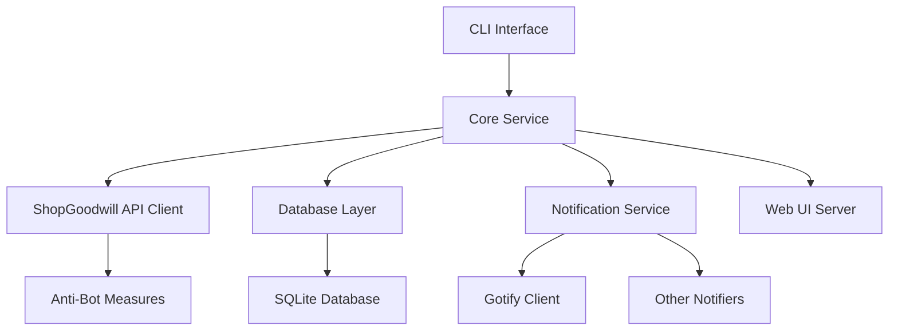

# go-find-goodwill Implementation Plan

## Overview
This document outlines the comprehensive implementation plan for the `go-find-goodwill` application, which will monitor ShopGoodwill for items matching user-defined searches and provide notifications.

## Current Architecture Analysis
The existing golang-starter template provides:
- Cobra-based CLI structure
- Environment variable configuration
- Modular package organization
- Logging infrastructure
- Build and deployment tooling

## System Architecture

### High-Level Component Diagram


### Detailed Architecture Components

#### 1. CLI Interface (Existing Structure)
- **Location**: `cmd/go-find-goodwill/`
- **Function**: Command-line interface using Cobra
- **Enhancements Needed**:
  - Add subcommands for search management
  - Add flags for configuration overrides
  - Add commands for database operations

#### 2. Core Service
- **Location**: `internal/goodwill/`
- **Components**:
  - Search Manager
  - Result Processor
  - Deduplication Engine
  - Scheduling System

#### 3. ShopGoodwill API Client
- **Location**: `internal/goodwill/api/`
- **Function**: Interface with ShopGoodwill API
- **Features**:
  - Authentication handling
  - Search execution
  - Item detail fetching
  - Rate limiting
  - Error handling

#### 4. Database Layer
- **Location**: `internal/goodwill/db/`
- **Database**: SQLite with `github.com/mattn/go-sqlite3`
- **Tables**:
  - `searches` - User-defined search queries
  - `search_history` - Past search executions
  - `items` - Found items with deduplication
  - `item_details` - Detailed item information
  - `price_history` - Historical pricing data
  - `bid_history` - Bidding history

#### 5. Notification Service
- **Location**: `internal/goodwill/notifications/`
- **Components**:
  - Gotify client
  - Multi-notifier interface
  - Notification queue
  - Delivery tracking

#### 6. Web UI Server
- **Location**: `internal/goodwill/web/`
- **Framework**: Based on `github.com/toozej/go-listen`
- **Features**:
  - REST API for search management
  - Web interface for configuration
  - Dashboard for search results

#### 7. Anti-Bot Measures
- **Location**: `internal/goodwill/antibot/`
- **Features**:
  - User agent rotation
  - Exponential backoff
  - Randomized timing
  - Request throttling

## Database Schema Design

### SQLite Database Schema
```sql
-- Searches table
CREATE TABLE searches (
    id INTEGER PRIMARY KEY AUTOINCREMENT,
    name TEXT NOT NULL,
    query TEXT NOT NULL,
    regex_pattern TEXT,
    enabled BOOLEAN DEFAULT 1,
    created_at TIMESTAMP DEFAULT CURRENT_TIMESTAMP,
    updated_at TIMESTAMP DEFAULT CURRENT_TIMESTAMP,
    last_checked TIMESTAMP,
    notification_threshold_days INTEGER DEFAULT 1
);

-- Search history
CREATE TABLE search_history (
    id INTEGER PRIMARY KEY AUTOINCREMENT,
    search_id INTEGER NOT NULL,
    executed_at TIMESTAMP DEFAULT CURRENT_TIMESTAMP,
    status TEXT NOT NULL,
    items_found INTEGER DEFAULT 0,
    error_message TEXT,
    FOREIGN KEY (search_id) REFERENCES searches(id)
);

-- Items table (deduplicated)
CREATE TABLE items (
    id INTEGER PRIMARY KEY AUTOINCREMENT,
    goodwill_id TEXT NOT NULL UNIQUE,
    title TEXT NOT NULL,
    seller TEXT,
    current_price REAL,
    buy_now_price REAL,
    url TEXT NOT NULL,
    image_url TEXT,
    ends_at TIMESTAMP,
    created_at TIMESTAMP DEFAULT CURRENT_TIMESTAMP,
    updated_at TIMESTAMP DEFAULT CURRENT_TIMESTAMP,
    first_seen TIMESTAMP DEFAULT CURRENT_TIMESTAMP
);

-- Item details
CREATE TABLE item_details (
    id INTEGER PRIMARY KEY AUTOINCREMENT,
    item_id INTEGER NOT NULL,
    description TEXT,
    condition TEXT,
    shipping_cost REAL,
    shipping_method TEXT,
    category TEXT,
    subcategory TEXT,
    FOREIGN KEY (item_id) REFERENCES items(id)
);

-- Price history
CREATE TABLE price_history (
    id INTEGER PRIMARY KEY AUTOINCREMENT,
    item_id INTEGER NOT NULL,
    price REAL NOT NULL,
    recorded_at TIMESTAMP DEFAULT CURRENT_TIMESTAMP,
    FOREIGN KEY (item_id) REFERENCES items(id)
);

-- Bid history
CREATE TABLE bid_history (
    id INTEGER PRIMARY KEY AUTOINCREMENT,
    item_id INTEGER NOT NULL,
    bid_amount REAL NOT NULL,
    bidder TEXT,
    recorded_at TIMESTAMP DEFAULT CURRENT_TIMESTAMP,
    FOREIGN KEY (item_id) REFERENCES items(id)
);

-- Search to item mapping (for tracking which searches found which items)
CREATE TABLE search_item_mapping (
    search_id INTEGER NOT NULL,
    item_id INTEGER NOT NULL,
    found_at TIMESTAMP DEFAULT CURRENT_TIMESTAMP,
    PRIMARY KEY (search_id, item_id),
    FOREIGN KEY (search_id) REFERENCES searches(id),
    FOREIGN KEY (item_id) REFERENCES items(id)
);

-- Notifications
CREATE TABLE notifications (
    id INTEGER PRIMARY KEY AUTOINCREMENT,
    item_id INTEGER NOT NULL,
    notification_type TEXT NOT NULL,
    status TEXT NOT NULL,
    sent_at TIMESTAMP,
    error_message TEXT,
    FOREIGN KEY (item_id) REFERENCES items(id)
);
```

## Configuration System

### Environment Variables
```
# ShopGoodwill credentials
GOODWILL_USERNAME=your_username
GOODWILL_PASSWORD=your_password

# Search configuration
SEARCH_INTERVAL_MINUTES=15
NOTIFICATION_THRESHOLD_DAYS=1

# Notification settings
GOTIFY_URL=https://gotify.example.com
GOTIFY_TOKEN=your_token
ENABLE_EMAIL_NOTIFICATIONS=false
SMTP_SERVER=smtp.example.com
SMTP_PORT=587
SMTP_USERNAME=user@example.com
SMTP_PASSWORD=password

# Anti-bot measures
ENABLE_USER_AGENT_ROTATION=true
MIN_SEARCH_INTERVAL_VARIATION=5
MAX_SEARCH_INTERVAL_VARIATION=10

# Web UI settings
WEB_SERVER_PORT=8080
WEB_SERVER_HOST=0.0.0.0

# Database settings
DB_PATH=./goodwill.db
```

### CLI Flags
```
--debug                      Enable debug logging
--username string            ShopGoodwill username
--password string            ShopGoodwill password
--search-interval int        Search interval in minutes (default 15)
--notification-threshold int Notification threshold in days (default 1)
--gotify-url string          Gotify server URL
--gotify-token string        Gotify authentication token
--web-port int               Web server port (default 8080)
--db-path string             Database file path (default ./goodwill.db)
--disable-regex              Disable regex-based similar searches
--run-once                   Run search once and exit
--import-searches string     Import searches from JSON file
--export-searches string     Export searches to JSON file
```

## Implementation Phases

### Phase 1: Core Infrastructure
1. **Database Layer**
   - Implement SQLite database schema
   - Create repository pattern for data access
   - Implement migration system

2. **Configuration System**
   - Extend existing config package
   - Add environment variable parsing
   - Add CLI flag integration

3. **ShopGoodwill API Client**
   - Implement authentication
   - Create search API wrapper
   - Add error handling and retries

### Phase 2: Core Functionality
1. **Search Engine**
   - Implement search execution
   - Add result processing
   - Implement deduplication logic

2. **Notification System**
   - Create Gotify client
   - Implement notification queue
   - Add multi-notifier interface

3. **Scheduling System**
   - Implement timed searches
   - Add randomized timing
   - Create exponential backoff

### Phase 3: Web Interface
1. **REST API**
   - CRUD endpoints for searches
   - Search result endpoints
   - Configuration endpoints

2. **Web UI**
   - Search management interface
   - Result dashboard
   - Configuration pages

### Phase 4: Anti-Bot Measures
1. **User Agent Rotation**
   - Implement rotating user agents
   - Add user agent management

2. **Request Throttling**
   - Implement rate limiting
   - Add exponential backoff

3. **Randomized Timing**
   - Add jitter to search intervals
   - Implement adaptive timing

## Package Structure Plan

```
internal/goodwill/
├── api/                  # ShopGoodwill API client
│   ├── client.go         # Main client implementation
│   ├── auth.go           # Authentication handling
│   ├── search.go         # Search API methods
│   └── models.go         # API data models
├── db/                   # Database layer
│   ├── repository.go     # Main repository interface
│   ├── migrations/       # Database migrations
│   ├── models.go         # Database models
│   └── sqlite/           # SQLite implementation
├── core/                 # Core business logic
│   ├── search/           # Search management
│   ├── deduplication/    # Item deduplication
│   ├── scheduling/       # Search scheduling
│   └── processing/       # Result processing
├── notifications/        # Notification system
│   ├── gotify/           # Gotify client
│   ├── email/            # Email notifications
│   └── manager.go        # Notification manager
├── web/                  # Web interface
│   ├── api/              # REST API handlers
│   ├── ui/               # Web UI components
│   └── server.go         # HTTP server
└── antibot/              # Anti-bot measures
    ├── useragent/        # User agent rotation
    ├── timing/           # Timing randomization
    └── throttling/       # Request throttling
```

## Implementation Timeline

### Week 1: Foundation
- [ ] Set up database schema and migrations
- [ ] Implement basic configuration system
- [ ] Create ShopGoodwill API client stub
- [ ] Implement core search execution logic

### Week 2: Core Features
- [ ] Complete search result processing
- [ ] Implement item deduplication
- [ ] Build notification system
- [ ] Add basic scheduling

### Week 3: Web Interface
- [ ] Implement REST API endpoints
- [ ] Create basic web UI
- [ ] Add search management interface
- [ ] Build result dashboard

### Week 4: Anti-Bot & Polish
- [ ] Implement user agent rotation
- [ ] Add request throttling
- [ ] Implement randomized timing
- [ ] Add comprehensive logging
- [ ] Complete documentation

## Technical Considerations

### Error Handling
- Implement structured error handling throughout
- Add comprehensive logging for debugging
- Implement retry logic for API failures

### Performance
- Optimize database queries
- Implement caching for frequent operations
- Add batch processing for notifications

### Security
- Secure credential storage
- Input validation for all user inputs
- Rate limiting for API endpoints

### Testing
- Unit tests for all components
- Integration tests for key workflows
- End-to-end testing for critical paths

## Dependencies to Add

```bash
go get github.com/mattn/go-sqlite3
go get github.com/gotify/go-api-client
go get github.com/PuerkitoBio/goquery  # For HTML parsing if needed
go get github.com/robfig/cron/v3       # For scheduling
```

## Next Steps

1. **Immediate**: Create database schema and migrations
2. **Priority**: Implement ShopGoodwill API client
3. **Critical**: Build core search and deduplication logic
4. **Important**: Implement notification system
5. **Final**: Add web interface and anti-bot measures

This plan provides a comprehensive roadmap for implementing the go-find-goodwill application while leveraging the existing golang-starter template structure.