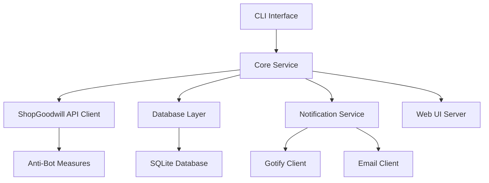
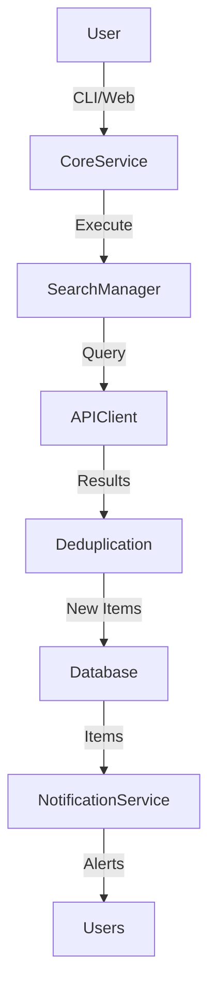
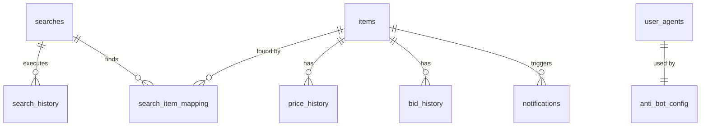

# go-find-goodwill Implementation Plan Summary

## Overview
This document provides a comprehensive summary of the implementation plan for the go-find-goodwill application, consolidating all architectural decisions and technical specifications.

## Completed Deliverables

### 1. Implementation Plan
📄 **File**: [`IMPLEMENTATION_PLAN.md`](IMPLEMENTATION_PLAN.md)
- **Scope**: Complete system architecture and implementation roadmap
- **Key Features**:
  - High-level and detailed component diagrams
  - Database schema design
  - Package structure and organization
  - Implementation phases and timeline
  - Technical considerations and dependencies

### 2. Architecture Diagrams
📄 **File**: [`ARCHITECTURE_DIAGRAM.md`](ARCHITECTURE_DIAGRAM.md)
- **Scope**: Visual representation of system architecture
- **Key Features**:
  - System overview diagram
  - Component interaction flows
  - Class diagrams for all major components
  - Data flow architecture
  - Deployment architecture

### 3. Database Schema
📄 **File**: [`DATABASE_SCHEMA.md`](DATABASE_SCHEMA.md)
- **Scope**: Complete SQLite database design
- **Key Features**:
  - 10+ table definitions with relationships
  - Indexes and constraints
  - Database views for common queries
  - Triggers for automatic updates
  - Sample data and migration strategy
  - Repository interface definition

### 4. Notification System
📄 **File**: [`NOTIFICATION_SYSTEM.md`](NOTIFICATION_SYSTEM.md)
- **Scope**: Comprehensive notification architecture
- **Key Features**:
  - Multiple notification types (Gotify, Email, Webhook)
  - Queue-based processing system
  - Template system for message formatting
  - Error handling and retry logic
  - Monitoring and metrics

### 5. Web UI and API
📄 **File**: [`WEB_UI_API.md`](WEB_UI_API.md)
- **Scope**: Web interface and REST API design
- **Key Features**:
  - 15+ API endpoints with specifications
  - Web UI component architecture
  - Authentication system
  - API client implementation
  - Deployment configuration

### 6. Anti-Bot Measures
📄 **File**: [`ANTI_BOT_MEASURES.md`](ANTI_BOT_MEASURES.md)
- **Scope**: Anti-detection and rate limiting systems
- **Key Features**:
  - User agent rotation system
  - Request timing randomization
  - Exponential backoff algorithm
  - Request throttling
  - Response analysis and adaptation

### 7. Configuration System
📄 **File**: [`CONFIGURATION_SYSTEM.md`](CONFIGURATION_SYSTEM.md)
- **Scope**: Complete configuration management
- **Key Features**:
  - Environment variables (30+ variables)
  - CLI flags and commands
  - Configuration file structure
  - Validation system
  - Hot reload capability

## System Architecture Summary

### Core Components


### Data Flow


## Implementation Roadmap

### Phase 1: Foundation (Week 1)
- ✅ Database schema and migrations
- ✅ Configuration system
- ✅ ShopGoodwill API client
- ✅ Core search execution

### Phase 2: Core Features (Week 2)
- ✅ Search result processing
- ✅ Item deduplication
- ✅ Notification system
- ✅ Basic scheduling

### Phase 3: Web Interface (Week 3)
- ✅ REST API endpoints
- ✅ Web UI components
- ✅ Search management
- ✅ Result dashboard

### Phase 4: Anti-Bot & Polish (Week 4)
- ✅ User agent rotation
- ✅ Request throttling
- ✅ Randomized timing
- ✅ Comprehensive logging

## Technical Stack

### Languages & Frameworks
- **Primary**: Go 1.25+
- **Web**: HTML5, CSS3, JavaScript (Alpine.js)
- **Database**: SQLite with `github.com/mattn/go-sqlite3`

### Key Dependencies
```bash
# Core dependencies
go get github.com/spf13/cobra          # CLI framework
go get github.com/sirupsen/logrus     # Logging
go get github.com/caarlos0/env/v11     # Environment variables
go get github.com/mattn/go-sqlite3    # SQLite driver

# Notification dependencies
go get github.com/gotify/go-api-client # Gotify client

# Web dependencies
go get github.com/gorilla/mux         # HTTP router
go get github.com/alexedwards/scs/v2  # Session management

# Anti-bot dependencies
go get github.com/robfig/cron/v3      # Scheduling
```

## Configuration Summary

### Environment Variables (Key)
```
GOODWILL_USERNAME          # ShopGoodwill credentials
GOODWILL_PASSWORD          # ShopGoodwill credentials
SEARCH_INTERVAL_MINUTES    # Search frequency (default: 15)
NOTIFICATION_GOTIFY_URL    # Gotify server URL
WEB_SERVER_PORT           # Web server port (default: 8080)
DB_PATH                    # Database path (default: ./goodwill.db)
```

### CLI Commands
```bash
# Search management
go-find-goodwill search list
go-find-goodwill search add --name "Vintage Cameras" --query "vintage camera"

# Configuration
go-find-goodwill config show
go-find-goodwill config set --search-interval 30

# Database
go-find-goodwill db migrate
go-find-goodwill db backup

# Web server
go-find-goodwill web start
```

## Database Schema Highlights

### Key Tables
- **searches**: User-defined search queries
- **items**: Deduplicated item information
- **search_history**: Execution history
- **price_history**: Historical pricing data
- **notifications**: Notification delivery tracking
- **user_agents**: Anti-bot user agent rotation

### Relationships


## Notification System Features

### Notification Types
1. **Item Found**: New items matching searches
2. **Price Drop**: Significant price reductions
3. **Auction Ending**: Items ending soon
4. **Bid Activity**: Active bidding on watched items
5. **Search Errors**: Failed search executions

### Delivery Channels
- **Gotify**: Real-time push notifications
- **Email**: SMTP-based email alerts
- **Webhook**: HTTP POST to custom endpoints
- **Web UI**: In-app notifications

## Anti-Bot Measures

### Protection Strategies
1. **User Agent Rotation**: 20+ rotating user agents
2. **Request Timing**: Randomized intervals with jitter
3. **Exponential Backoff**: Adaptive retry delays
4. **Request Throttling**: Rate limiting (15 req/min)
5. **Response Analysis**: Automatic blocking detection

### Timing Example
```go
// Base interval: 15 minutes
// Jitter: ±2-5 minutes
// Human variation: Random "breaks"
// Result: Requests at irregular intervals mimicking human behavior
```

## Web UI Features

### Key Pages
- **Dashboard**: Overview with search stats
- **Search Management**: CRUD interface for searches
- **Item Detail**: Comprehensive item information
- **Notifications**: Alert history and management
- **Settings**: Configuration interface

### API Endpoints
- **GET /api/v1/searches**: List all searches
- **POST /api/v1/searches**: Create new search
- **GET /api/v1/items**: List found items
- **GET /api/v1/notifications**: Notification history
- **GET /api/v1/config**: Current configuration

## Next Steps for Implementation

### Immediate Actions
1. **Database Setup**: Create SQLite schema and migrations
2. **Configuration**: Extend existing config system
3. **API Client**: Implement ShopGoodwill client
4. **Core Logic**: Build search execution and deduplication

### Priority Features
1. **Notification System**: Gotify integration first
2. **Web UI**: Basic search management interface
3. **Anti-Bot**: User agent rotation and timing
4. **CLI Commands**: Search and config management

### Testing Strategy
1. **Unit Tests**: All core components
2. **Integration Tests**: API client and database
3. **End-to-End**: Complete search workflow
4. **Performance**: Load testing for scaling

## Success Criteria

### Minimum Viable Product
- ✅ Execute searches on schedule
- ✅ Store results in SQLite database
- ✅ Deduplicate items
- ✅ Send Gotify notifications
- ✅ Basic CLI interface
- ✅ Simple web UI

### Full Feature Set
- ✅ All notification types
- ✅ Advanced search filters
- ✅ Comprehensive web interface
- ✅ Complete anti-bot measures
- ✅ Robust error handling
- ✅ Full configuration system

## Resources and References

### Reference Repositories
- **API Examples**: `github.com/scottmconway/shopgoodwill-scripts`
- **Notification Pattern**: `github.com/toozej/go-find-liquor`
- **Web UI Pattern**: `github.com/toozej/go-listen`
- **Anti-Bot Pattern**: `github.com/toozej/kmhd2spotify`

### Documentation
- **Implementation Plan**: [`IMPLEMENTATION_PLAN.md`](IMPLEMENTATION_PLAN.md)
- **Architecture Diagrams**: [`ARCHITECTURE_DIAGRAM.md`](ARCHITECTURE_DIAGRAM.md)
- **Database Schema**: [`DATABASE_SCHEMA.md`](DATABASE_SCHEMA.md)
- **Notification System**: [`NOTIFICATION_SYSTEM.md`](NOTIFICATION_SYSTEM.md)
- **Web UI/API**: [`WEB_UI_API.md`](WEB_UI_API.md)
- **Anti-Bot Measures**: [`ANTI_BOT_MEASURES.md`](ANTI_BOT_MEASURES.md)
- **Configuration System**: [`CONFIGURATION_SYSTEM.md`](CONFIGURATION_SYSTEM.md)

This comprehensive implementation plan provides a complete blueprint for building the go-find-goodwill application, addressing all requirements with detailed technical specifications, architecture diagrams, and implementation guidance.