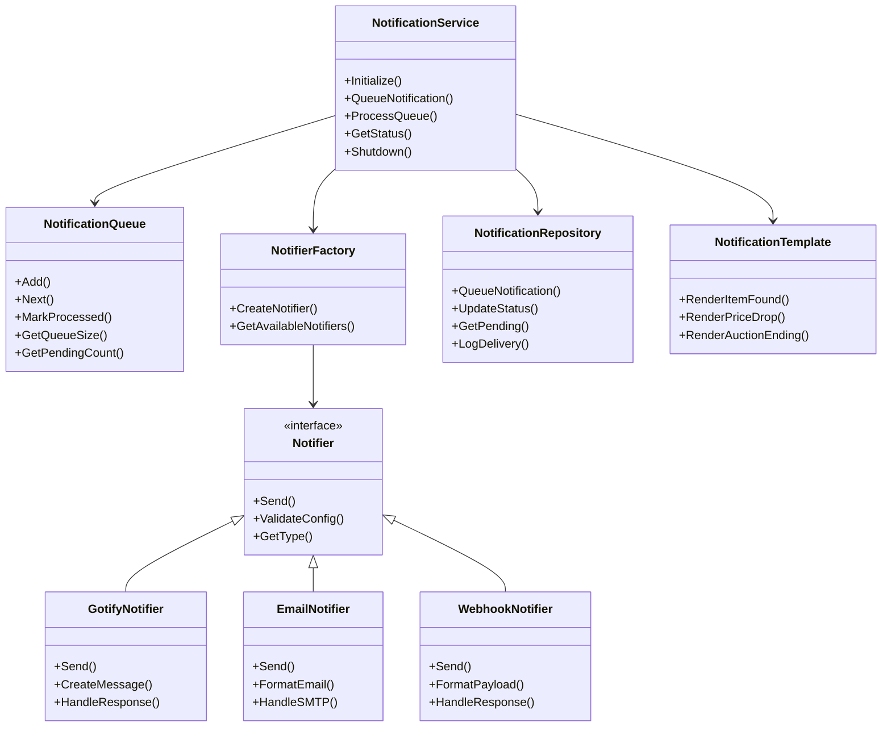
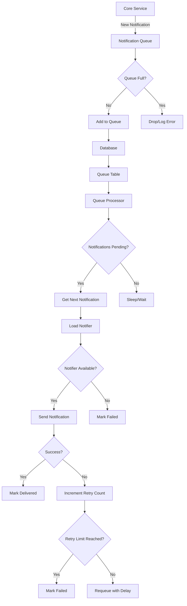
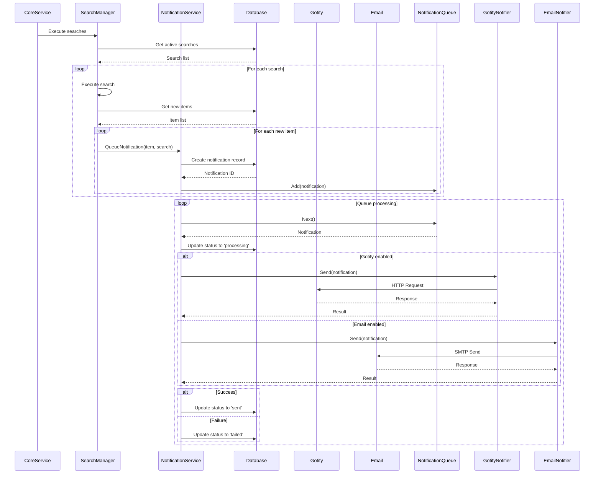
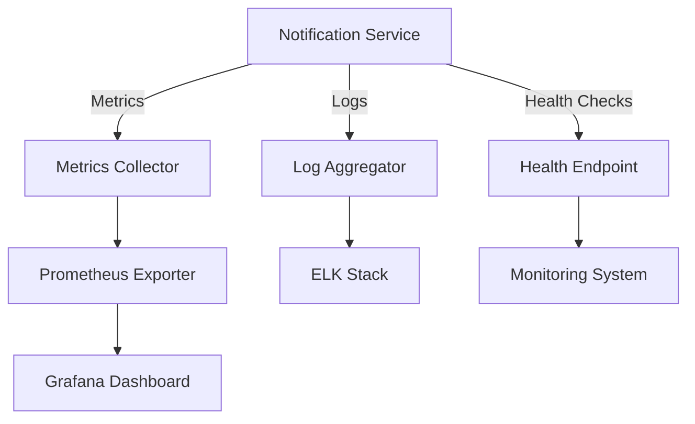

# go-find-goodwill Notification System Architecture

## Overview
This document details the notification system architecture for the go-find-goodwill application, including notification types, delivery mechanisms, queue management, and integration patterns.

## Notification System Architecture



## Notification Types

### 1. Item Found Notifications
- **Trigger**: New item matches search criteria
- **Content**: Item details, price, auction end time
- **Urgency**: Medium
- **Template**: `item_found_template`

### 2. Price Drop Notifications
- **Trigger**: Item price drops below threshold
- **Content**: Item details, old vs new price, percentage drop
- **Urgency**: High
- **Template**: `price_drop_template`

### 3. Auction Ending Notifications
- **Trigger**: Item auction ending within notification threshold
- **Content**: Item details, time remaining, current price
- **Urgency**: Critical
- **Template**: `auction_ending_template`

### 4. Bid Activity Notifications
- **Trigger**: Significant bid activity on watched item
- **Content**: Item details, bid history, current price
- **Urgency**: Medium
- **Template**: `bid_activity_template`

### 5. Search Error Notifications
- **Trigger**: Search execution fails repeatedly
- **Content**: Search name, error details, retry count
- **Urgency**: High
- **Template**: `search_error_template`

## Notification Delivery System

### Queue Architecture


### Queue Processing Algorithm
```go
func (s *NotificationService) processQueue() {
    for {
        select {
        case <-s.shutdownChan:
            return
        default:
            // Get next notification from queue
            notification, err := s.queue.Next()
            if err != nil {
                if err == ErrQueueEmpty {
                    time.Sleep(s.emptyQueueSleep)
                    continue
                }
                s.log.Errorf("Error getting next notification: %v", err)
                continue
            }

            // Process notification
            err = s.processNotification(notification)
            if err != nil {
                s.log.Errorf("Error processing notification %d: %v", notification.ID, err)
                // Requeue with exponential backoff
                s.requeueWithBackoff(notification)
            }
        }
    }
}
```

## Notifier Implementations

### 1. Gotify Notifier
```go
type GotifyNotifier struct {
    client     *gotify.Client
    config     GotifyConfig
    templates  *NotificationTemplate
    log       *logrus.Logger
}

func (n *GotifyNotifier) Send(notification *Notification) error {
    // Create message
    message := n.createMessage(notification)

    // Send to Gotify
    resp, err := n.client.CreateMessage(message)
    if err != nil {
        return fmt.Errorf("gotify send failed: %w", err)
    }

    // Check response
    if resp.StatusCode != http.StatusOK {
        return fmt.Errorf("gotify returned status %d", resp.StatusCode)
    }

    return nil
}

func (n *GotifyNotifier) createMessage(notif *Notification) *gotify.Message {
    // Render template based on notification type
    content := n.templates.Render(notif.Type, notif.Data)

    return &gotify.Message{
        Title:    fmt.Sprintf("Goodwill Alert: %s", notif.Item.Title),
        Message:  content,
        Priority: n.getPriority(notif.Type),
        Extras: map[string]interface{}{
            "itemId": notif.Item.ID,
            "itemUrl": notif.Item.URL,
        },
    }
}
```

### 2. Email Notifier
```go
type EmailNotifier struct {
    smtpClient *smtp.Client
    config     EmailConfig
    templates  *NotificationTemplate
    log       *logrus.Logger
}

func (n *EmailNotifier) Send(notification *Notification) error {
    // Format email
    email := n.formatEmail(notification)

    // Connect to SMTP server
    err := n.connect()
    if err != nil {
        return fmt.Errorf("smtp connection failed: %w", err)
    }
    defer n.disconnect()

    // Send email
    err = n.smtpClient.SendMail(
        n.config.From,
        []string{notification.Recipient},
        email,
    )
    if err != nil {
        return fmt.Errorf("email send failed: %w", err)
    }

    return nil
}
```

## Notification Templates

### Template Structure
```go
type NotificationTemplate struct {
    templates map[string]*template.Template
}

func NewNotificationTemplate() *NotificationTemplate {
    return &NotificationTemplate{
        templates: make(map[string]*template.Template),
    }
}

func (t *NotificationTemplate) LoadTemplates() error {
    // Load all template files from templates/ directory
    templates := []string{
        "item_found",
        "price_drop",
        "auction_ending",
        "bid_activity",
        "search_error",
    }

    for _, name := range templates {
        content, err := os.ReadFile(fmt.Sprintf("templates/%s.html", name))
        if err != nil {
            return fmt.Errorf("failed to load template %s: %w", name, err)
        }

        tmpl, err := template.New(name).Parse(string(content))
        if err != nil {
            return fmt.Errorf("failed to parse template %s: %w", name, err)
        }

        t.templates[name] = tmpl
    }

    return nil
}
```

### Sample Template (item_found.html)
```html
<!DOCTYPE html>
<html>
<head>
    <title>New Goodwill Item Found: {{.Item.Title}}</title>
</head>
<body>
    <h1>🎉 New Item Found Matching Your Search!</h1>

    <h2>{{.Item.Title}}</h2>

    <p><strong>Price:</strong> ${{.Item.CurrentPrice}}</p>
    <p><strong>Buy Now:</strong> ${{.Item.BuyNowPrice}}</p>
    <p><strong>Ends:</strong> {{.Item.EndsAt}}</p>
    <p><strong>Seller:</strong> {{.Item.Seller}}</p>

    <a href="{{.Item.URL}}">View Item on ShopGoodwill</a>

    <p>This item was found by your search: <strong>{{.Search.Name}}</strong></p>

    <p>You're receiving this notification because the item matches your search criteria.</p>
</body>
</html>
```

## Configuration Structure

### Notification Configuration
```go
type NotificationConfig struct {
    Gotify GotifyConfig
    Email  EmailConfig
    Webhook WebhookConfig
    RetryPolicy RetryPolicy
    RateLimits RateLimits
}

type GotifyConfig struct {
    Enabled bool
    URL     string
    Token   string
    Priority int
}

type EmailConfig struct {
    Enabled     bool
    SMTPServer  string
    SMTPPort    int
    Username    string
    Password    string
    From        string
    To          string
}

type WebhookConfig struct {
    Enabled bool
    URLs    []string
    Timeout time.Duration
}

type RetryPolicy struct {
    MaxRetries     int
    InitialBackoff  time.Duration
    MaxBackoff     time.Duration
}

type RateLimits struct {
    MaxPerMinute int
    BurstLimit    int
}
```

## Integration with Core System

### Notification Service Integration


## Error Handling and Recovery

### Error Classification
1. **Transient Errors**: Network issues, temporary service unavailability
2. **Configuration Errors**: Invalid settings, missing credentials
3. **Rate Limit Errors**: API rate limits exceeded
4. **Permanent Errors**: Invalid recipient, blocked sender

### Retry Strategy
```go
func (s *NotificationService) shouldRetry(err error, retryCount int) bool {
    // Don't retry configuration errors
    if isConfigError(err) {
        return false
    }

    // Don't retry if max retries reached
    if retryCount >= s.config.RetryPolicy.MaxRetries {
        return false
    }

    // Don't retry rate limit errors immediately
    if isRateLimitError(err) {
        return true // But with longer backoff
    }

    // Retry transient errors
    return isTransientError(err)
}

func (s *NotificationService) calculateBackoff(retryCount int) time.Duration {
    backoff := s.config.RetryPolicy.InitialBackoff
    for i := 0; i < retryCount; i++ {
        backoff *= 2
        if backoff > s.config.RetryPolicy.MaxBackoff {
            backoff = s.config.RetryPolicy.MaxBackoff
            break
        }
    }
    return backoff
}
```

## Monitoring and Metrics

### Notification Metrics
```go
type NotificationMetrics struct {
    TotalSent        int64
    TotalFailed      int64
    CurrentQueueSize int64
    ProcessingTime   time.Duration
    LastProcessed    time.Time
    ErrorRates       map[string]int64
}
```

### Monitoring Integration


## Security Considerations

### Data Protection
- **Credential Encryption**: Encrypt sensitive notification credentials
- **Secure Transmission**: Use HTTPS for all external notifications
- **Input Validation**: Validate all notification content
- **Rate Limiting**: Prevent notification flooding

### Privacy Compliance
- **Recipient Validation**: Ensure proper recipient handling
- **Data Minimization**: Only include necessary item details
- **Opt-out Support**: Provide unsubscribe mechanisms

## Performance Optimization

### Batch Processing
- Process notifications in batches where possible
- Use connection pooling for SMTP and HTTP clients
- Implement parallel processing for independent notifications

### Caching
- Cache template rendering results
- Cache notifier configurations
- Cache common notification content

### Resource Management
- Limit concurrent notification workers
- Implement graceful shutdown
- Monitor memory usage

## Implementation Roadmap

### Phase 1: Core Notification System
- [ ] Implement notification queue
- [ ] Create database repository
- [ ] Build basic notifier interface
- [ ] Implement Gotify notifier

### Phase 2: Additional Notifiers
- [ ] Implement email notifier
- [ ] Add webhook notifier
- [ ] Create template system

### Phase 3: Advanced Features
- [ ] Add retry and backoff logic
- [ ] Implement rate limiting
- [ ] Add monitoring and metrics
- [ ] Implement security features

This comprehensive notification system architecture provides a robust foundation for delivering timely alerts to users about ShopGoodwill items matching their search criteria, with support for multiple notification channels and reliable delivery mechanisms.