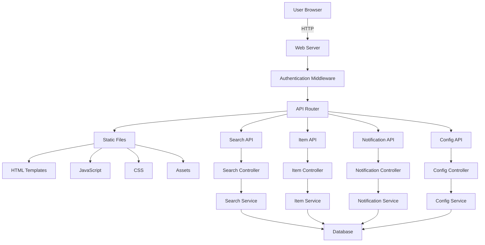
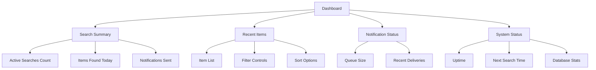
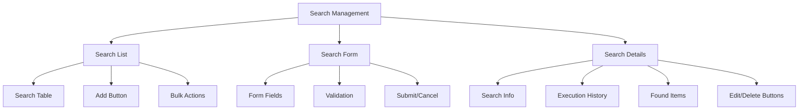
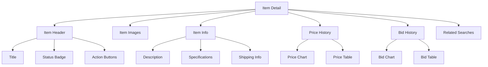
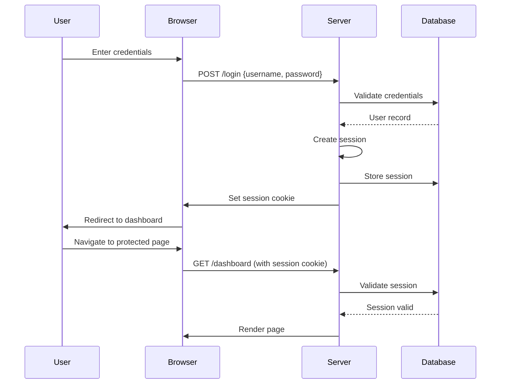

# go-find-goodwill Web UI and API Specification

## Overview
This document specifies the web interface and REST API design for the go-find-goodwill application, including endpoint definitions, request/response formats, and UI component structure.

## Web UI Architecture



## API Endpoint Specification

### Base URL: `/api/v1`

### 1. Search Management Endpoints

#### GET `/searches`
- **Description**: List all searches
- **Authentication**: Required
- **Query Parameters**:
  - `enabled` (boolean): Filter by enabled status
  - `limit` (int): Pagination limit
  - `offset` (int): Pagination offset
- **Response**:
```json
{
  "searches": [
    {
      "id": 1,
      "name": "Vintage Cameras",
      "query": "vintage camera",
      "enabled": true,
      "last_checked": "2023-01-01T12:00:00Z",
      "notification_threshold_days": 1,
      "item_count": 5,
      "created_at": "2023-01-01T10:00:00Z",
      "updated_at": "2023-01-01T11:00:00Z"
    }
  ],
  "total": 10,
  "limit": 20,
  "offset": 0
}
```

#### POST `/searches`
- **Description**: Create new search
- **Authentication**: Required
- **Request Body**:
```json
{
  "name": "Vintage Cameras",
  "query": "vintage camera",
  "enabled": true,
  "notification_threshold_days": 1,
  "min_price": 50.00,
  "max_price": 500.00,
  "category_filter": "Cameras & Photo",
  "regex_pattern": "leica|canon|nikon"
}
```
- **Response**: Created search object

#### GET `/searches/{id}`
- **Description**: Get search details
- **Authentication**: Required
- **Response**: Search object with full details

#### PUT `/searches/{id}`
- **Description**: Update search
- **Authentication**: Required
- **Request Body**: Partial or complete search object
- **Response**: Updated search object

#### DELETE `/searches/{id}`
- **Description**: Delete search
- **Authentication**: Required
- **Response**: Success status

#### POST `/searches/{id}/execute`
- **Description**: Manually execute search
- **Authentication**: Required
- **Response**: Execution status and results

### 2. Item Management Endpoints

#### GET `/items`
- **Description**: List items
- **Authentication**: Required
- **Query Parameters**:
  - `search_id` (int): Filter by search
  - `status` (string): Filter by status (active, ended, won)
  - `min_price` (float): Minimum price filter
  - `max_price` (float): Maximum price filter
  - `category` (string): Category filter
  - `sort` (string): Sort field (ends_at, price, created_at)
  - `order` (string): Sort order (asc, desc)
  - `limit` (int): Pagination limit
  - `offset` (int): Pagination offset
- **Response**:
```json
{
  "items": [
    {
      "id": 1,
      "goodwill_id": "GW123456",
      "title": "Vintage Leica Camera",
      "seller": "Goodwill Store #123",
      "current_price": 150.00,
      "buy_now_price": 200.00,
      "url": "https://shopgoodwill.com/item/gw123456",
      "image_url": "https://shopgoodwill.com/image.jpg",
      "ends_at": "2023-01-05T15:30:00Z",
      "status": "active",
      "category": "Cameras & Photo",
      "condition": "Used - Good",
      "shipping_cost": 12.99,
      "first_seen": "2023-01-01T12:00:00Z",
      "last_seen": "2023-01-01T14:30:00Z",
      "search_ids": [1, 3],
      "price_history": [
        {"price": 150.00, "recorded_at": "2023-01-01T12:00:00Z"},
        {"price": 145.00, "recorded_at": "2023-01-01T13:00:00Z"}
      ]
    }
  ],
  "total": 50,
  "limit": 20,
  "offset": 0
}
```

#### GET `/items/{id}`
- **Description**: Get item details
- **Authentication**: Required
- **Response**: Full item object with all details

#### GET `/items/{id}/history`
- **Description**: Get item price and bid history
- **Authentication**: Required
- **Response**:
```json
{
  "price_history": [
    {"price": 150.00, "type": "current", "recorded_at": "2023-01-01T12:00:00Z"},
    {"price": 145.00, "type": "current", "recorded_at": "2023-01-01T13:00:00Z"}
  ],
  "bid_history": [
    {"bid_amount": 145.00, "bidder": "user123", "recorded_at": "2023-01-01T13:00:00Z"},
    {"bid_amount": 150.00, "bidder": "user456", "recorded_at": "2023-01-01T14:00:00Z"}
  ]
}
```

### 3. Notification Endpoints

#### GET `/notifications`
- **Description**: List notifications
- **Authentication**: Required
- **Query Parameters**:
  - `status` (string): Filter by status (queued, sent, failed)
  - `type` (string): Filter by type (item_found, price_drop, etc.)
  - `limit` (int): Pagination limit
  - `offset` (int): Pagination offset
- **Response**:
```json
{
  "notifications": [
    {
      "id": 1,
      "item_id": 1,
      "search_id": 1,
      "type": "item_found",
      "status": "sent",
      "created_at": "2023-01-01T12:05:00Z",
      "sent_at": "2023-01-01T12:06:00Z",
      "item": {
        "id": 1,
        "title": "Vintage Leica Camera",
        "url": "https://shopgoodwill.com/item/gw123456"
      },
      "search": {
        "id": 1,
        "name": "Vintage Cameras"
      }
    }
  ],
  "total": 10,
  "limit": 20,
  "offset": 0
}
```

#### POST `/notifications/test`
- **Description**: Send test notification
- **Authentication**: Required
- **Request Body**:
```json
{
  "type": "item_found",
  "item_id": 1,
  "search_id": 1,
  "recipient": "test@example.com"
}
```
- **Response**: Test result and delivery status

### 4. Configuration Endpoints

#### GET `/config`
- **Description**: Get current configuration
- **Authentication**: Required
- **Response**:
```json
{
  "search_interval_minutes": 15,
  "notification_threshold_days": 1,
  "gotify": {
    "enabled": true,
    "url": "https://gotify.example.com",
    "priority": 5
  },
  "email": {
    "enabled": false,
    "smtp_server": "smtp.example.com",
    "from": "alerts@example.com"
  },
  "anti_bot": {
    "user_agent_rotation": true,
    "min_interval_variation": 5,
    "max_interval_variation": 10
  }
}
```

#### PUT `/config`
- **Description**: Update configuration
- **Authentication**: Required
- **Request Body**: Partial or complete config object
- **Response**: Updated configuration

### 5. System Endpoints

#### GET `/system/status`
- **Description**: Get system status
- **Authentication**: Optional
- **Response**:
```json
{
  "status": "running",
  "version": "1.0.0",
  "uptime": "24h30m",
  "last_search": "2023-01-01T14:00:00Z",
  "next_search": "2023-01-01T14:15:00Z",
  "queue_size": 5,
  "database": {
    "searches": 10,
    "items": 50,
    "notifications_sent": 150
  }
}
```

#### GET `/system/logs`
- **Description**: Get system logs
- **Authentication**: Required
- **Query Parameters**:
  - `level` (string): Filter by log level
  - `limit` (int): Number of entries
  - `component` (string): Filter by component
- **Response**:
```json
{
  "logs": [
    {
      "timestamp": "2023-01-01T12:00:00Z",
      "level": "info",
      "component": "search",
      "message": "Executed search 'Vintage Cameras', found 2 new items"
    }
  ],
  "total": 100
}
```

## Web UI Component Structure

### Directory Structure
```
internal/goodwill/web/
├── ui/
│   ├── components/          # Reusable UI components
│   ├── pages/              # Page templates
│   ├── static/             # Static assets
│   └── templates/          # HTML templates
├── api/                    # API handlers
├── middleware/             # HTTP middleware
└── server.go               # HTTP server
```

### UI Pages

#### 1. Dashboard Page


#### 2. Search Management Page


#### 3. Item Detail Page


## API Implementation Details

### Middleware Chain
```go
func (s *Server) setupMiddleware() {
    // Recovery middleware
    s.router.Use(recoveryMiddleware())

    // Logging middleware
    s.router.Use(loggingMiddleware(s.log))

    // CORS middleware
    s.router.Use(corsMiddleware())

    // Authentication middleware
    s.router.Use(authMiddleware(s.config))

    // Rate limiting middleware
    s.router.Use(rateLimitMiddleware())

    // Request ID middleware
    s.router.Use(requestIDMiddleware())
}
```

### Error Handling
```go
type APIError struct {
    Code    int    `json:"code"`
    Message string `json:"message"`
    Details string `json:"details,omitempty"`
}

func (s *Server) handleError(w http.ResponseWriter, err error, statusCode int) {
    s.log.Errorf("API Error: %v", err)

    response := APIError{
        Code:    statusCode,
        Message: http.StatusText(statusCode),
    }

    if os.Getenv("DEBUG") == "true" {
        response.Details = err.Error()
    }

    w.Header().Set("Content-Type", "application/json")
    w.WriteHeader(statusCode)
    json.NewEncoder(w).Encode(response)
}
```

## Web UI Technology Stack

### Frontend Framework
- **Framework**: Alpine.js (lightweight, no build step)
- **CSS**: Tailwind CSS (utility-first)
- **Icons**: Heroicons or similar
- **Charts**: Chart.js for data visualization

### Sample HTML Template Structure
```html
<!DOCTYPE html>
<html lang="en">
<head>
    <meta charset="UTF-8">
    <meta name="viewport" content="width=device-width, initial-scale=1.0">
    <title>go-find-goodwill - {{.Title}}</title>
    <link href="/static/css/tailwind.css" rel="stylesheet">
    <script defer src="/static/js/alpine.js"></script>
</head>
<body class="bg-gray-100">
    <div class="min-h-screen flex">
        <!-- Sidebar -->
        <aside class="w-64 bg-white shadow">
            <div class="p-4">
                <h1 class="text-xl font-bold">go-find-goodwill</h1>
            </div>
            <nav class="mt-4">
                <a href="/dashboard" class="block px-4 py-2 text-gray-700 hover:bg-gray-100">Dashboard</a>
                <a href="/searches" class="block px-4 py-2 text-gray-700 hover:bg-gray-100">Searches</a>
                <a href="/items" class="block px-4 py-2 text-gray-700 hover:bg-gray-100">Items</a>
                <a href="/notifications" class="block px-4 py-2 text-gray-700 hover:bg-gray-100">Notifications</a>
                <a href="/settings" class="block px-4 py-2 text-gray-700 hover:bg-gray-100">Settings</a>
            </nav>
        </aside>

        <!-- Main Content -->
        <main class="flex-1 p-6">
            {{template "content" .}}
        </main>
    </div>

    <!-- Flash Messages -->
    <div id="flash-messages" class="fixed top-4 right-4 space-y-2">
        {{range .FlashMessages}}
        <div class="bg-{{.Type}}-100 border border-{{.Type}}-400 text-{{.Type}}-700 px-4 py-3 rounded">
            {{.Message}}
        </div>
        {{end}}
    </div>

    <script>
        // Auto-dismiss flash messages
        setTimeout(() => {
            document.getElementById('flash-messages').style.display = 'none';
        }, 5000);
    </script>
</body>
</html>
```

## API Client Implementation

### JavaScript API Client
```javascript
class GoodwillAPI {
    constructor(baseUrl = '/api/v1') {
        this.baseUrl = baseUrl;
        this.csrfToken = document.querySelector('meta[name="csrf-token"]').content;
    }

    async request(method, endpoint, data = null) {
        const url = `${this.baseUrl}${endpoint}`;
        const options = {
            method: method,
            headers: {
                'Content-Type': 'application/json',
                'X-CSRF-Token': this.csrfToken
            }
        };

        if (data) {
            options.body = JSON.stringify(data);
        }

        try {
            const response = await fetch(url, options);

            if (!response.ok) {
                const errorData = await response.json();
                throw new Error(errorData.message || 'API request failed');
            }

            return response.json();
        } catch (error) {
            console.error('API Error:', error);
            throw error;
        }
    }

    // Search methods
    async getSearches(params = {}) {
        const query = new URLSearchParams(params);
        return this.request('GET', `/searches?${query}`);
    }

    async createSearch(search) {
        return this.request('POST', '/searches', search);
    }

    // Item methods
    async getItems(params = {}) {
        const query = new URLSearchParams(params);
        return this.request('GET', `/items?${query}`);
    }

    // Notification methods
    async getNotifications(params = {}) {
        const query = new URLSearchParams(params);
        return this.request('GET', `/notifications?${query}`);
    }
}
```

## Authentication System

### Session-Based Authentication


### Authentication Middleware
```go
func authMiddleware(config *config.Config) func(http.Handler) http.Handler {
    return func(next http.Handler) http.Handler {
        return http.HandlerFunc(func(w http.ResponseWriter, r *http.Request) {
            // Skip auth for public endpoints
            if r.URL.Path == "/login" || r.URL.Path == "/health" {
                next.ServeHTTP(w, r)
                return
            }

            // Check session cookie
            sessionCookie, err := r.Cookie("session_id")
            if err != nil {
                http.Redirect(w, r, "/login", http.StatusFound)
                return
            }

            // Validate session
            session, err := validateSession(sessionCookie.Value)
            if err != nil {
                http.Redirect(w, r, "/login", http.StatusFound)
                return
            }

            // Add session to context
            ctx := context.WithValue(r.Context(), "session", session)
            next.ServeHTTP(w, r.WithContext(ctx))
        })
    }
}
```

## Deployment Configuration

### Web Server Configuration
```yaml
# Web server configuration
server:
  host: "0.0.0.0"
  port: 8080
  read_timeout: 30s
  write_timeout: 30s
  idle_timeout: 120s
  tls:
    enabled: false
    cert_file: ""
    key_file: ""
  static_dir: "web/static"
  template_dir: "web/templates"
  cors:
    allowed_origins: ["*"]
    allowed_methods: ["GET", "POST", "PUT", "DELETE", "OPTIONS"]
    allowed_headers: ["Content-Type", "Authorization"]
```

### Rate Limiting Configuration
```yaml
rate_limiting:
  enabled: true
  requests_per_minute: 120
  burst_limit: 20
  ip_whitelist: ["127.0.0.1", "::1"]
```

## Implementation Roadmap

### Phase 1: Core API
- [ ] Implement search endpoints
- [ ] Create item endpoints
- [ ] Build notification endpoints
- [ ] Add configuration endpoints

### Phase 2: Web UI Foundation
- [ ] Create base HTML templates
- [ ] Implement dashboard page
- [ ] Build search management interface
- [ ] Create item detail views

### Phase 3: Advanced Features
- [ ] Add real-time updates with Server-Sent Events
- [ ] Implement WebSocket notifications
- [ ] Add data export functionality
- [ ] Create comprehensive error pages

### Phase 4: Security and Performance
- [ ] Implement CSRF protection
- [ ] Add input validation
- [ ] Implement caching headers
- [ ] Add compression middleware

This comprehensive web UI and API specification provides a complete blueprint for the user interface and HTTP API of the go-find-goodwill application, supporting all required functionality for search management, item tracking, and notification delivery.